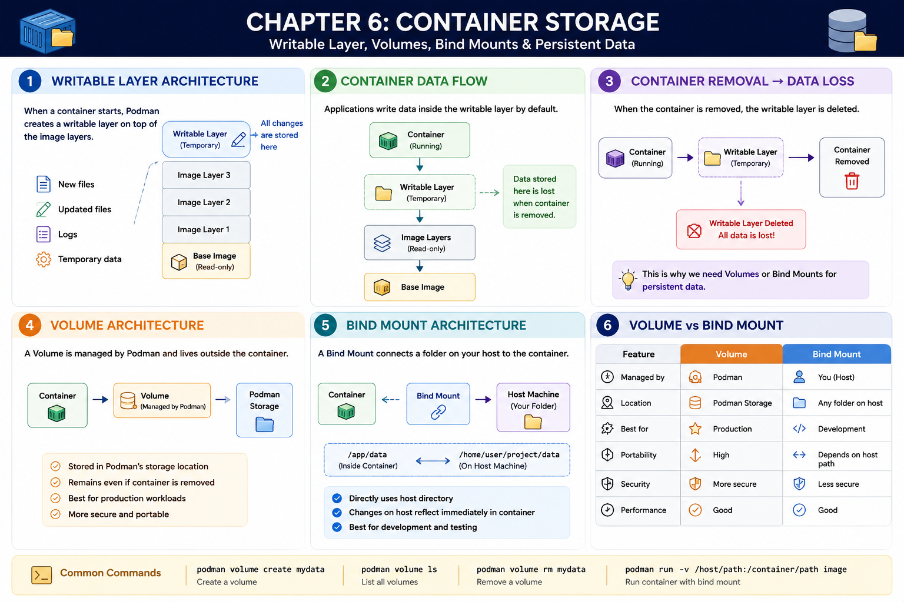

# Chapter 6: Container Storage & Volumes

### &#x20;Goal

Understand how Containers store data, why data is lost when a Container is removed, and how **Volumes** and **Bind Mounts** help store data permanently.

#### By the end of this chapter, you will understand:

* What is a Writable Layer?
* Where does Container data get stored?
* Why is Container data temporary?
* What are Volumes?
* What are Bind Mounts?
* What is Persistent Data?
* Difference between Volumes and Bind Mounts

***

## Before We Start...

Suppose you run your application:

```bash
podman run notes-app
```

Your Container starts successfully.

Now imagine your application creates a file:

```
report.txt
```

Everything works perfectly.

Later, you remove the Container.

```bash
podman rm notes-app
```

Now the question is...

> **What happens to `report.txt`?**

The answer is: **It is deleted.**

Let's understand why.

***

## Overview

<figure><figcaption></figcaption></figure>

***

## Step 1: Images are Read-only

Remember,

An **Image** is only a blueprint.

```
Container Image

Application
Python
Libraries
```

Images cannot be modified.

Whenever a Container starts, Podman creates a new layer above the Image.

***

## Step 2: Writable Layer

When a Container starts,

Podman creates a **Writable Layer**.

```
┌──────────────────────┐
│   Writable Layer     │
├──────────────────────┤
│    Image Layers      │
├──────────────────────┤
│     Base Image       │
└──────────────────────┘
```

All new data is stored here.

Examples:

* New files
* Updated files
* Logs
* Temporary data

***

## Step 3: Where is Container Data Stored?

Suppose your application creates:

```
report.txt
```

It is stored inside the Writable Layer.

```
Writable Layer

report.txt
logs.txt
config.json
```

The original Image remains unchanged.

***

## Step 4: What Happens When the Container is Removed?

Execute:

```bash
podman rm notes-app
```

Podman deletes the Container.

Since the Writable Layer belongs to that Container,

it is also deleted.

```
Container Deleted
↓
Writable Layer Deleted
↓
All Changes Lost ❌
```

Everything stored inside the Writable Layer disappears.

***

## Step 5: The Need for Persistent Storage

Imagine running:

* MySQL
* PostgreSQL
* MongoDB
* User Uploads

If all data disappears whenever the Container is removed,

the application becomes useless.

We need **Persistent Storage**.

***

## Step 6: Volumes

A **Volume** is a storage location managed by Podman.

Instead of storing data inside the Writable Layer,

the Container stores data inside the Volume.

```
Container
      │
      ▼
Volume
      │
      ▼
Hard Disk
```

Even if the Container is removed,

the Volume still exists.

***

## Step 7: Bind Mounts

A **Bind Mount** connects a folder on your computer directly to a folder inside the Container.

```
Your Computer
│
└── /home/user/project
        │
        ▼
Container
│
└── /app
```

Both locations point to the same files.

If you edit a file on your computer,

the Container immediately sees the changes.

***

## Step 8: Persistent Data

Persistent Data is data that remains available even after a Container is removed.

Examples:

* Database records
* User uploads
* Configuration files
* Application logs

Without Persistent Storage:

```
Container

↓

Delete Container

↓

Data Lost ❌
```

With Persistent Storage:

```
Container
      │
      ▼
Volume / Bind Mount

↓

Delete Container

↓

Data Still Exists ✅
```

***

## Step 9: Volume vs Bind Mount

| Volume                       | Bind Mount                       |
| ---------------------------- | -------------------------------- |
| Managed by Podman            | Managed by You                   |
| Stored inside Podman Storage | Stored anywhere on your computer |
| Best for Production          | Best for Development             |
| More Portable                | Easier to edit files             |
| Better Security              | Direct access to host files      |

***

## Step 10: When Should We Use Them?

#### Use Volumes when:

* Running Databases
* Production Applications
* Storing User Data
* Keeping Data Safe

Examples:

* MySQL
* PostgreSQL
* MongoDB

***

#### Use Bind Mounts when:

* Developing Applications
* Editing Source Code
* Testing Changes Quickly

Example:

```
VS Code

↓

Save File

↓

Container Instantly Uses Updated File
```

No need to rebuild the Image every time.

***

## Common Commands

#### Create a Volume

```bash
podman volume create mydata
```

***

#### View Volumes

```bash
podman volume ls
```

***

#### Remove a Volume

```bash
podman volume rm mydata
```

***

#### Run a Container using a Bind Mount

```bash
podman run -v /home/user/project:/app notes-app
```

This connects:

```
/home/user/project

↓

/app (inside Container)
```

***

## Internal Working

```
             Image
               │
               ▼
         Create Container
               │
               ▼
       Writable Layer Created
               │
      ┌────────┴────────┐
      ▼                 ▼
Temporary Data     Persistent Data
      │                 │
      ▼                 ▼
Deleted          Volume / Bind Mount
with Container    (Data Remains)
```

***

## Key Terms

### Writable Layer

A temporary storage layer created when a Container starts.

It is deleted when the Container is removed.

***

### Volume

A Podman-managed storage location used for permanent data.

***

### Bind Mount

A connection between a folder on the host machine and a folder inside a Container.

***

### Persistent Data

Data that remains available even after a Container is removed.

***

## 📝 Key Takeaways

* Images are Read-only.
* Containers receive a Writable Layer.
* Writable Layer stores temporary data.
* Removing a Container deletes the Writable Layer.
* Volumes provide permanent storage.
* Bind Mounts connect host folders to Containers.
* Persistent Data survives Container removal.
* Volumes are preferred for production.
* Bind Mounts are useful during development.

***

## ⚡ Quick Revision

✅ Image → Read-only

✅ Writable Layer → Temporary Storage

✅ Volume → Permanent Storage

✅ Bind Mount → Host Folder ↔ Container Folder

✅ Persistent Data → Survives Container Removal

***

## 🎯 Interview Questions

#### 1. What is a Writable Layer?

A Writable Layer is a temporary storage layer created when a Container starts. It stores all changes made during the Container's lifetime.

***

#### 2. What happens to the Writable Layer when a Container is removed?

It is deleted along with all the data stored inside it.

***

#### 3. What is a Volume?

A Volume is a Podman-managed storage location that keeps data even after the Container is removed.

***

#### 4. What is a Bind Mount?

A Bind Mount connects a directory on the host machine to a directory inside a Container.

***

#### 5. What is the difference between a Volume and a Bind Mount?

Volumes are managed by Podman and are best for production. Bind Mounts directly use host directories and are ideal for development.

***

#### 6. Why do we need Persistent Storage?

Persistent Storage ensures that important data such as databases, user uploads, and logs remain available even after a Container is deleted.
